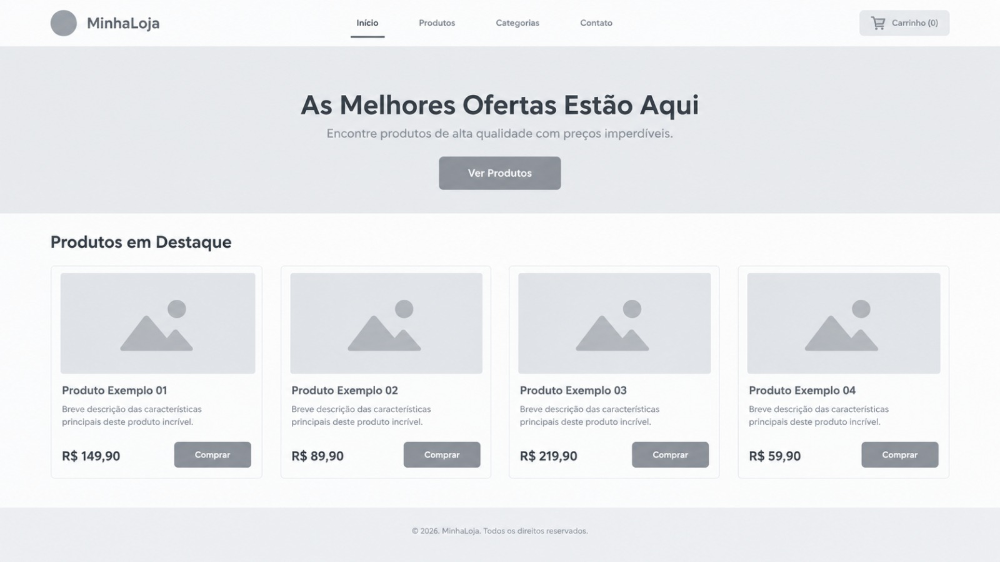
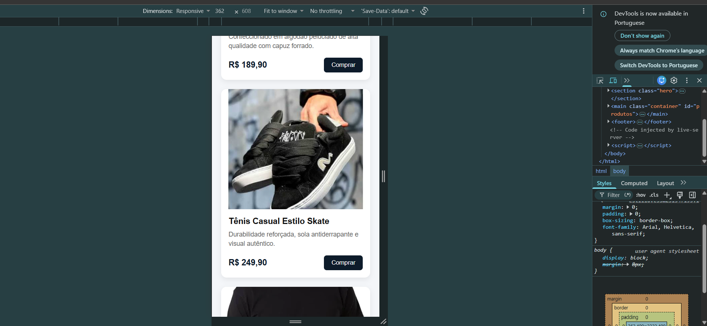
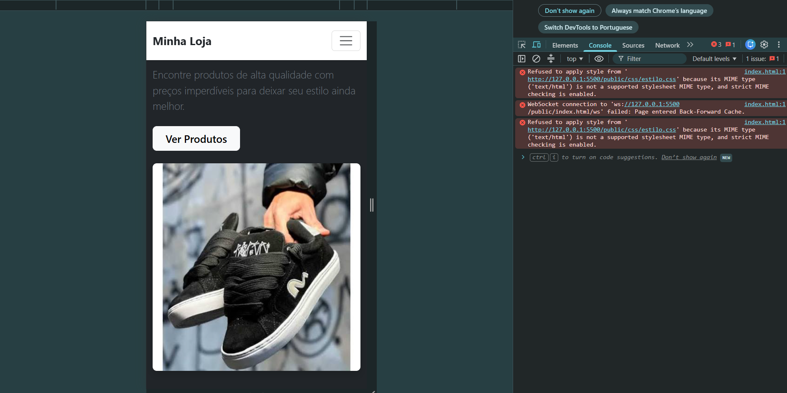

# ATV-semana-4
Seu nome: Vinicius Arantes Silva 

número de matrícula: 936807

proposta de projeto escolhida: Ecommerce

breve descrição sobre o projeto: Este projeto foi idealizado para estruturar e centralizar a lógica de comparação, análise e apresentação de produtos de forma dinâmica.
A proposta central da aplicação é fornecer uma experiência intuitiva e organizada para processar dados de itens e auxiliar escolhas eficientes.
Dessa forma, o sistema serve como uma base digital moderna e altamente customizável para simplificar tomadas de decisão e otimizar pesquisas.

Imagem do esboço (wireframe) criado para o projeto: 

Print da home-page criada para o projeto: 

Print projeto em tela de smartphone: 

Print projeto em tela de Desktop: 

Print projeto em tela de Desktop: 

Print projeto em tela de Mobile: 